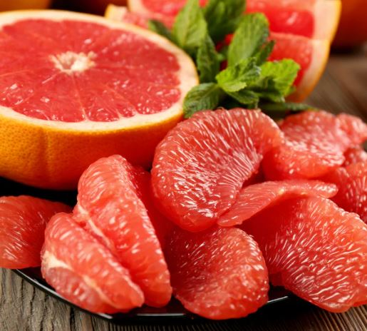

# **Radiation**: *The Core of Mutation Breeding*
Mutation breeding is a process that makes use of a plant's genetic makeup and accelerating its development through radiation. This allows the selection of valuable agronomic traits and the creation of new mutant plants. This method of breeding is usually done with the use of radiation or heavily charged particles, however it may create instability in the plant's genome which limits the process of generating prefered alleles. Moreover, mutation breeding can aid in the diversity of plants, production of huge populations, and possibly end worldwide famine.

  

    
  

